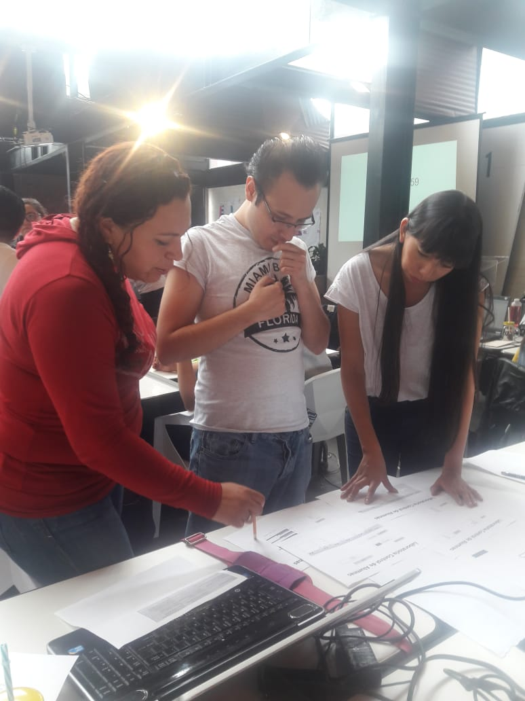
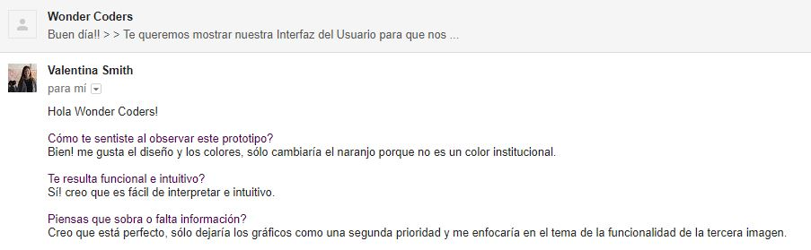

# **Data Dashboard**

## **Proceso de UX**

Nuestro primer acercamiento lo haremos a través del proceso de diseño, donde pasamos por diferentes etapas como:

### **1. Descubrimiento e investigación**
<!-- (En esta fase es donde vamos a tener ese proceso de investigación y acercamiento con el usuario, es donde vamos a obtener el conocimiento para poder saber a quién vamos a llegar, pero de manera más profunda. Es tener la empatía y el acercamiento necesario para conocerlo.

También vamos a tener en cuenta al negocio, sus objetivos y a los stakeholders(involucrados)). -->
En Laboratoria, las Training Managers hacen un gran trabajo al analizar la mayor cantidad de datos posibles respecto al progreso de las estudiantes para apoyarlas en su aprendizaje. Esta actividad se ha entorpecido debido al uso actual de Spreadsheets de Google un elemento que nos es tan funcional por la cantidad de información que se analiza al mismo tiempo.
<!-- __Usuarixs:__  (Toda la información que sepas de ellxs, ya sea porque las has podido observar o porque obtuviste datos directamente de ellas) -->
Contactamos a tres de las principales usuarias de nuestro producto.
*	Lucile Baratier de Ciudad de México
*	Karla Rejas de Guadalajara, México
*	Alejandra Ramirez  de  Lima, Perú
* Valentina Smith de Blanco Recoleta
* Vanessa Pinheiro
<!-- __Necesidades de las usuarias:__ -->
<!-- __Objetivos de las usuarias:__ (Lo que quieren o esperan lograr) -->
<!-- __Pain points:__ (En sus actividades diarias qué es lo que más les molesta u obstaculiza en el proceso de  realizar sus actividades/objetivos)
__Sentimientos:__(Sentimientos que les surgen dentro del proceso de sus actividades. Identificar cuáles predominan)
__Técnicas usadas en esta fase:__ (Sabemos que en este punto, tal vez, sólo has ocupado encuestas, no te olvides de documentar este proceso de recolección de datos) -->
Hicimos una serie de preguntas por e-mail a las TM´S de Guadalajara y Lima, en el caso de Lucile (TM de CDMX) fue una entrevista
presencial.

Durante la investigación nos percatamos de la importancia de este proyecto, ya que les podría ayudar agilizando su trabajo diario y les ayudaría a tomar decisiones de forma práctica en base a la visualización de números (avances en LMS, quizz, lecturas, proyectos, etc).

Al entrevistarlas todas expresaron su tedio y frustración al no poder concentrar tanta información en una sola página, ya que tienen que abrir varias hojas desde un drive que se actualiza constantemente. Todas coinciden en que no es muy funcional porque es mucha información que deben sintetizar de forma manual a través de fórmulas además no está en un formato amigable a la vista y lo utilizan porque es la única herramienta que tienen  para procesar la data del progreso de las alumnas.

# **Pain points**
●	Ir de archivo en archivo para obtener información del progreso de las alumnas
●	Les absorbe demasiado tiempo
●	Cálculos manuales
●	No es fácil de utilizar
●	Información dispersa
●	Spreadsheets tarda en  cargar  por tanta información
●	No es uniforme la información en todas las sedes

# **Objetivos de los usuarios**

Lo que esperan del Data Dashboard:

➢	Visualizar la información fácil
➢	Automatizado y procesado
➢	Poder tomar decisiones
➢	Muy entendible
➢	Visualizar perfil por perfil
➢	Poder filtrar por sede, generación

También coinciden que los datos más relevantes que les agradaria visualizar en particular son: número total de estudiantes, número de deserciones y porcentaje de avance en LMS (Learning Management System).

#**Objetivos del negocio**
Laboratoria tiene como objetivo empoderar al mayor número de mujeres a través de conocimiento en el ámbito Tech,  a la par las TM´s se encargan de darle seguimiento a las alumnas que están actualmente en el bootcamp siguiendo una rúbrica de evaluación para cada proyecto, lecturas y quizz realizados en el LMS, además de tener en cuenta las deserciones.

#**Motivaciones del negocio para el data dashboard**
En resumen se espera la siguiente funcionalidad del progama:

* Listar y poder seleccionar sedes
* Dentro de cada sede:
  * Listar y poder seleccionar generaciones
  * Para cada generación:
    * Listar y poder seleccionar estudiantes mostrando porcentaje general de completitud de c/estudiante
    * Seleccionar estudiantes mostrando reporte de progreso:
        * Mostrar porcentaje de completitud de todos los temas
        * Calcular porcentaje de tiempo completado de cada tema
        * Listar subtemas de cada tema
        * Poder filtrar subtemas completados y no-completados de cada tema
        * Poder filtrar subtemas por tipos (ejercicios, lecturas y quizzes)
  * En la vista de cada generación mostrar reporte de:
    * Promedio de la generación
    * Generar status para identificar estudiantes debajo del 60 en su porcentaje de completitud
    * Generar status para identificar estudiantes con 90 o más en su porcentaje de completitud
    * Poder filtrar estudiantes por estos dos status
    * Filtrar y poder buscar estudiantes por nombre
    * Poder ordenar de manera ascendente y descendente a las estudiantes según
    porcentaje de completitud
* Utiliza la interfaz sin problemas desde distintos tamaños de pantallas:
  móviles, tablets, desktops

### **2. Síntesis y definición**
<!-- (Dada la fase anterior de investigación, ahora vamos a tomar todos los datos más importantes y transformarlos en información valiosa para comenzar a orientarse a la solución. También vamos a entender lo que la empresa quiere de ese producto y comenzar a entender ambas visiones con el fin de encontrar un punto armónico) -->

<!-- __1. Cuáles crees que son los datos más importantes a tener en cuenta para el Data Dashboard:__

   - Sobre las estudiantes: -->
Procesar información de forma sencilla y rápida por ejemplo:

* Sedes
* Generaciones
* Avance General (Proyectos y LMS)
* Estudiantes Activas y deserciones  
* Asistencia
* Nivel de completitud LMS
* Ruta de Aprendizaje y Desempeño de acuerto a la Rúbrica de Niveles esperados
<!-- __2. Lo que los usuarios esperan obtener:__
__3. Insights:__ -->
Data proporcionada:
- Sede
- Generaciones
- Nombre de las Estudiantes
- Correo
- Progreso > Duración programa
- Porcentaje Completado > Temas

<!-- Data relacionada a los cursos:
- Temas
- Duración Temas
- Puntuación temas  -->

<!-- __5.Insights del negocio:__ -->

### **Ideación**
<!-- (Acá se comienza a pensar esa solución tomando en cuenta la información recopilada y procesada) -->
Al tener clara la problemática de las TM´s para poder alcanzar dichos objetivos optamos por hacer un sketch y diagrama de flujo sencillo de acuerdo a las necesidades presentadas.

### **4. Prototipado**
<!-- (Esta es la fase creativa, donde se comienza a construir el Data dashboard con la información obtenida de las fases anteriores. Se reafirma crear la experiencia de usuario, donde la solución resuelve necesidades y facilita la vida)
Sketch: (Adjuntar liga)Prototipo en figma: (Adjuntar liga) -->

El objetivo del *Data Dashboard* es crear un producto cuya funcionalidad sea tener al día los avances de las estudiantes a través de una interfaz que sea sencilla, intuitiva y fácil de usar. Este producto está pensado en las Training Manager para que su trabajo sea más eficiente ya que ellas tienen la necesidad de revisar los avances y el progreso general y particular de las estudiantes de su propia sede.

Gracias a este producto se mostrará el avance del uso de la plataforma de aprendizaje LMS (Learning Managment System), también se encontrará información más específica del promedio de cada unidad y por subtema, así como también es importante mostrar el avance individual y detallado de cada estudiante.

### **User testing**
<!-- (Si deseas validar tu propuesta, acércate a tu usuario y que te de feedback con el fin de mejorar tu producto en beneficio del negocio y de tu usuarix). -->
Al mostrar el prototipo reecibimos los siguientes comentarios:

# Argumentacion de Diseño
Se usan colores que representan la identidad de Laboratoria, en particular se usa fondo blanco por la cantidad de información que se visualiza.

Se propone un *Login* es para que las ***Training Manager***  tengan acceso personalizado, ya que ellas tienen información confidencial de todas las estudiantes. Las gráficas que se muestran fueron pensadas en su fácil lectura, ya que por su estructura se ven los datos de forma visual mucho más rápido ya que se requiere poder ver datos muy generales y a la vez también poder acceder a datos específicos.

Todo esto se hace pensando en que su consulta será constante es por eso que tiene que ser una plataforma amigable y bastante intuitiva, los colores que utilizamos son los d Labratoria esto para seguir con la marca identificativa de laboratorio, Se muestra la propuesta gráfica del prototipo de Alta Fidelidad, se realizó en la plataforma *** FIGMA.***

